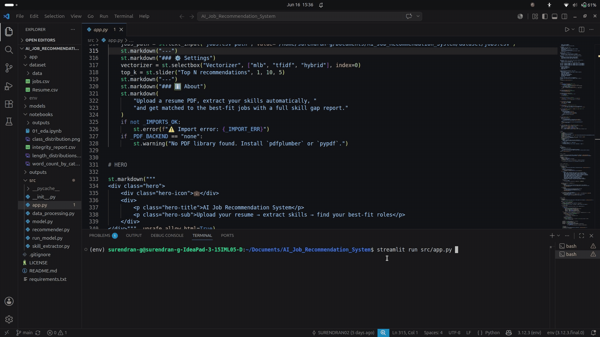

# 🤖 AI Job Recommendation System

An AI-powered Job Recommendation System that analyzes resumes, extracts skills, and matches candidates with relevant job opportunities using Machine Learning and Natural Language Processing (NLP).

## 📌 Overview

This project automates the process of matching resumes to job descriptions by:

* Extracting skills from resumes
* Processing and cleaning resume data
* Building skill-based feature vectors
* Computing similarity scores between resumes and jobs
* Recommending the most relevant jobs
* Identifying skill gaps between candidates and job requirements

## 🚀 Features

### Resume Processing

* Resume text preprocessing
* Skill extraction using NLP and rule-based techniques
* Skill normalization and cleaning

### Job Matching

* MultiLabelBinarizer (MLB) based vectorization
* TF-IDF based vectorization
* Hybrid vectorization support
* Cosine similarity matching

### Recommendations

* Top-K job recommendations
* Resume-to-job matching
* Job-to-candidate matching
* Match score calculation

### Skill Gap Analysis

* Matched skills
* Missing skills
* Extra skills
* Match percentage

### Interactive Dashboard

* Upload resume PDF
* Extract skills automatically
* View top job recommendations
* Analyze skill gaps
* User-friendly Streamlit interface

## 🎬 Demo




## 🏗️ Project Architecture

```text
Resume
   ↓
Data Processing
   ↓
Skill Extraction
   ↓
Feature Engineering
   ↓
Vectorization
   ↓
Cosine Similarity
   ↓
Job Matching
   ↓
Skill Gap Analysis
   ↓
Recommendations
```

## 📂 Project Structure

```text
AI_Job_Recommendation_System/

├── dataset/
│   └── jobs.csv

├── outputs/
│   ├── resume_skills.csv
│   ├── recommendations.csv
│   ├── skill_frequencies.csv
│   ├── skill_matrix.csv
│   └── skill_report.json

├── src/
│   ├── data_processing.py
│   ├── skill_extractor.py
│   ├── model.py
│   ├── recommender.py
│   └── app.py
    |

├── requirements.txt
├── README.md
└── .gitignore
```

## 🛠️ Technologies Used

* Python
* Pandas
* NumPy
* Scikit-Learn
* Streamlit
* NLP
* Cosine Similarity
* TF-IDF
* Machine Learning

## ⚙️ Installation

### Clone Repository

```bash
git clone https://github.com/YOUR_USERNAME/AI_Job_Recommendation_System.git
cd AI_Job_Recommendation_System
```

### Create Virtual Environment

```bash
python -m venv env
source env/bin/activate
```

### Install Dependencies

```bash
pip install -r requirements.txt
```

## ▶️ Running the Project

### Step 1: Extract Skills

```bash
python src/skill_extractor.py
```

### Step 2: Train Matching Model

```bash
python src/recommender.py
```

### Step 3: Launch Streamlit App

```bash
streamlit run src/app.py
```

## 📊 Example Output

### Top Job Recommendations

| Rank | Job Title                 | Match Score |
| ---- | ------------------------- | ----------- |
| 1    | Software Engineer         | 92%         |
| 2    | Data Scientist            | 88%         |
| 3    | Machine Learning Engineer | 84%         |
| 4    | Data Analyst              | 81%         |
| 5    | AI Engineer               | 78%         |

### Skill Gap Analysis

Matched Skills:

* Python
* SQL
* Machine Learning

Missing Skills:

* AWS
* Docker
* Kubernetes

Match Percentage:

* 78%

## 📈 Future Improvements

* BERT/Sentence Transformers based semantic matching
* Resume PDF parsing enhancement
* Job scraping integration
* Real-time recommendation API
* Candidate ranking dashboard
* Deployment on AWS/GCP/Azure
* Advanced analytics and visualizations

## 👨‍💻 Author

**Surendran G**

Computer Science Engineering Student

Interested in:

* Data Science
* Machine Learning
* Data Engineering
* Artificial Intelligence

## ⭐ Support

If you found this project useful:

* Star this repository
* Fork the project
* Contribute improvements
* Share feedback

---

Built with Python, Machine Learning, and NLP.
